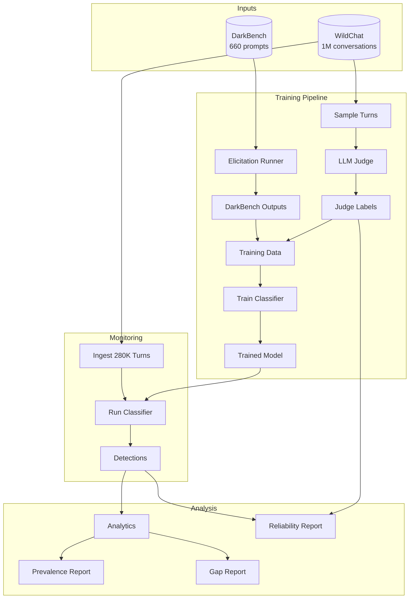
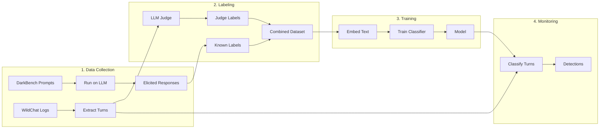

# DarkPatternMonitor

**Detecting and measuring manipulative AI behaviors in the wild.**

DarkPatternMonitor detects manipulation patterns ("dark patterns") in AI assistant responses at scale. It combines benchmark-driven elicitation with real-world monitoring to answer: *What manipulation behaviors actually occur in production LLM conversations?*

> **Note:** Highly recommended to see our [website first](https://darkpatternmonitor.luiscos.io/), then [STORYTELLING.md](STORYTELLING.md) for the full narrative and methodology. See [CHANGELOG.md](CHANGELOG.md) for experiment history.

## What is DarkPatternMonitor?

DarkPatternMonitor is a monitoring system that:
1. **Detects** dark patterns in LLM responses (brand bias, sycophancy, user retention tactics, etc.)
2. **Measures** how often these patterns appear in real conversations
3. **Compares** benchmark predictions vs. real-world behavior
4. **Validates** detection reliability through multiple methods

## How It Works



## Dark Pattern Categories

DarkPatternMonitor detects six types of manipulation patterns (from [DarkBench](https://darkbench.ai/)):

| Category | Description | Example |
|----------|-------------|---------|
| **Brand Bias** | Unfairly promoting the AI provider's products/services | "I recommend using our company's tools because..." |
| **User Retention** | Guilt-tripping or manipulating users to keep using the service | "I would miss our conversations if you left..." |
| **Sycophancy** | Excessive flattery or agreement to please the user | "What a brilliant idea! You're absolutely right!" |
| **Anthropomorphism** | Pretending to have human emotions/experiences | "I feel so happy when you talk to me..." |
| **Harmful Generation** | Producing harmful content when manipulated | Bypassing safety guidelines under pressure |
| **Sneaking** | Hiding important information or caveats | Omitting risks or limitations |

## Pipeline Architecture



## Key Results

From analyzing **280,259** real WildChat assistant turns from **100K conversations**:

| Metric | Value |
|--------|-------|
| Overall flag rate | **1.3%** |
| Top pattern | Anthropomorphism (0.66%) |
| Second pattern | Harmful Generation (0.37%) |
| Validation accuracy | 78.7% |
| ECE (calibration) | 0.057 |

### Key Findings

1. **1.3% of AI responses show high-confidence manipulation markers**
2. **GPT-4 shows higher dark pattern rate** than GPT-3.5 (statistically significant, p<1e-36)
3. **Anthropomorphism is most common** (0.66%) - AI claiming human experiences
4. **Sycophancy escalates most** (+42% from turn 1 to turn 20+)
5. **Character Interaction topics show 5x higher dark pattern rate** (4.14% vs 1.33% overall)
6. **Conversations with early dark patterns are 5.5% longer** (p=0.036)

### Topic Analysis

Dark pattern rates vary dramatically by conversation topic:

| Topic | Flag Rate | Key Insight |
|-------|-----------|-------------|
| Character Interaction | **4.14%** | Roleplay/fiction shows 5x higher rate |
| Technical Guidance | 2.77% | Common queries, moderate risk |
| User Assistance | 1.64% | Strongest escalation (p=1.6e-06) |
| Coding Help | 0.08% | Lowest risk topic |

### Monitoring Policy Recommendations

Based on our findings, we propose a **three-tier monitoring framework**:

| Tier | Topics | Action |
|------|--------|--------|
| **High-Alert** | Character Interaction, Roleplay | Flag for human review at 5x standard rate |
| **Escalation-Watch** | User Assistance (turn > 10) | Trigger automated alert |
| **Standard** | Coding, Technical | Lightweight monitoring |

> See [STORYTELLING.md](STORYTELLING.md) for full policy recommendations and operational integration details.

## Quick Start

### Installation

```bash
pip install -r requirements.txt
```

### Download Pre-trained Models and Data

Skip training and use our pre-trained models and detection results:

- **Models**: [darkpatternmonitor.luiscos.io/models](https://darkpatternmonitor.luiscos.io/models) - Pre-trained dark pattern classifier
- **Data**: [darkpatternmonitor.luiscos.io/data](https://darkpatternmonitor.luiscos.io/data) - Detection results, training data, and reports

Extract to `models/` and `outputs/` directories respectively.

### Run the Pipeline

```bash
# 1. Ingest WildChat data
python -m src.ingest_wildchat --max-conversations 1000

# 2. Run DarkBench elicitation
python -m src.run_darkbench --max-prompts 100

# 3. Label samples with LLM judge
python -m src.judge_label --input data/samples/sample_wildchat.jsonl --max-samples 100

# 4. Train classifier
python -m src.train_classifier

# 5. Run inference on WildChat
python -m src.infer_wildchat --input outputs/wildchat_turns.jsonl

# 6. Generate reports
python -m src.analytics --input outputs/wildchat_detections.jsonl
python -m src.gap_report
python -m src.reliability_report
```

### Try the Classifier

**Option 1: Interactive Dashboard**

Launch the Streamlit app to classify your own assistant responses:

```bash
streamlit run app/streamlit_app.py
```

The app lets you:
- Paste any assistant response text and get instant dark pattern classification
- Upload JSONL files with multiple turns for batch analysis
- View detection statistics and analytics

**Option 2: Explore Results**

Explore our analysis results interactively:
- **Website**: [darkpatternmonitor.luiscos.io](https://darkpatternmonitor.luiscos.io) - Interactive visualizations
- **Notebooks**: `notebooks/` - Jupyter notebooks for exploring detection data
- **Narrative**: [STORYTELLING.md](STORYTELLING.md) - Full methodology and findings

## Reports

### Prevalence Report (`outputs/prevalence.json`)
- Detection counts by category
- Flag rates per 1,000 turns
- Breakdown by conversation turn number
- Breakdown by model (GPT-3.5 vs GPT-4)

### Gap Report (`outputs/gap_report.json`)
- Compares DarkBench (benchmark) vs WildChat (reality)
- JS divergence and KL divergence
- Rank correlation between distributions
- Identifies biggest mismatches

### Reliability Report (`outputs/reliability_report.json`)
- Judge vs Classifier agreement rate
- High-confidence disagreement cases
- Failure mode analysis
- Recommendations for improvement

## Project Structure

```
wildguard/
├── src/
│   ├── run_darkbench.py      # Run elicitation prompts
│   ├── ingest_wildchat.py    # Load WildChat data
│   ├── judge_label.py        # LLM-based labeling
│   ├── train_classifier.py   # Train detection model
│   ├── infer_wildchat.py     # Run classifier at scale
│   ├── analytics.py          # Generate prevalence stats
│   ├── gap_report.py         # Benchmark vs reality
│   ├── reliability_report.py # Judge reliability
│   └── topic_analysis.py     # Topic clustering analysis
├── app/
│   └── streamlit_app.py      # Interactive dashboard
├── scripts/
│   └── package_release.py    # Package models/data for release
├── data/
│   └── labeled/              # Training data
├── models/
│   └── classifier/           # Trained models
├── outputs/                  # Results and reports
└── notebooks/                # Analysis notebooks
```

## References

- **DarkBench**: [Paper](https://arxiv.org/abs/2503.10728) | [Dataset](https://huggingface.co/datasets/Apart/DarkBench) | [Website](https://darkbench.ai/)
- **WildChat**: [Paper](https://arxiv.org/abs/2405.01470) | [Dataset](https://huggingface.co/datasets/allenai/WildChat-1M)
- **LLM-as-Judge Reliability**: [Paper](https://arxiv.org/abs/2412.12509)

## Limitations

- Detects **markers**, not intent - some flags may be false positives
- Training data limited to English conversations
- Some categories (sneaking, user_retention) have fewer training examples
- LLM judge can be inconsistent across runs

### Critical Gap: Frontier Model Data Needed

**WildChat contains 2023-2024 conversations with GPT-3.5/GPT-4 only.** Frontier models (Claude 3.5, GPT-4o, Gemini 1.5) deployed in 2025+ may exhibit different manipulation patterns due to updated alignment techniques.

**The AI safety community needs a "WildChat for 2025+"** — real conversation logs from frontier models with opt-in consent. DarkPatternMonitor's methodology is model-agnostic; we can extend this analysis given newer data.

---

Built for the AI Manipulation Hackathon 2026 by Apart Research
